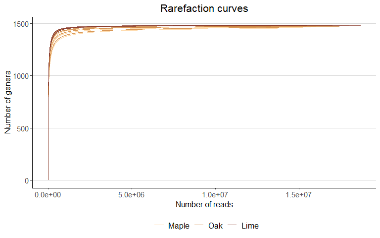

Rarefaction curves
================
Jule Freudenthal
2024-05-02

**R version:** 4.3.1 (2023-06-16), Beagle Scouts  
**Packages**

- ggplot2 v. 3.5.0  
- ggthemes v. 5.1.0  
- vegan v. 2.6-4

``` r
# Install packages
if (!require("ggplot2")) install.packages("ggplot2")
if (!require("ggthemes")) install.packages("ggthemes")
if (!require("vegan")) install.packages("vegan")

# Load packages
library(ggplot2)
library(ggthemes) 
library(vegan)
```

We calculated rarefaction curves to check whether we covered the entire
taxonomic diversity. All rarefaction curves reached saturation, thus we
continued the data analysis without normalizing for sequencing depth.

``` r
# We write a function that transforms rarefaction curves calculated with vegans function 'rarecurve' 
# to a dataframe usable for ggplot.
plot.to.df = function(rare.data, sample.ID){
  df <- data.frame(rare.data)
  colnames(df) <- "NumberOfOTUs"
  rownames(df) <- NULL
  `NumberOfReads` <- attr(rare.data, "Subsample")
  `SampleID` <- sample.ID
   return(cbind(`NumberOfReads`,df,`SampleID`))
}
```

``` r
# Load RNA count- and meta- and taxonomy data
load("Data/PreprocessedData/03CanopyBarkDataTraitsFiltered.rds")

# Transpose count data
counts.transposed <- t(counts)

#------------------------- 01 Calculate rarefaction curves -------------------------#
# Calculate rarefaction curves
rarecurves <- rarecurve(counts.transposed, step = 1000)
```

``` r
# MAPPLY applies a function to all elements of a vector or a list, having the same position.
rarefaction.data <- mapply(plot.to.df, rare.data = rarecurves,
                           sample.ID = as.list(row.names(counts.transposed)), SIMPLIFY = FALSE)

# Merge all data sets of the samples to one table
rarefaction.data <- do.call(rbind, rarefaction.data)

# Combine rarefaction data and metadata to one data frame 
rarefaction.data <- merge(rarefaction.data, metadata, by="SampleID", all = T)
```

``` r
#-------------------------------- 02 Visualisation ---------------------------------#
# Create plots
g = ggplot(rarefaction.data, aes(x = NumberOfReads, y = NumberOfOTUs, group = SampleID, 
                                  color = TreeSpecies)) +
  geom_line(linewidth = 0.6, alpha = 0.8) +
  labs(title = "Rarefaction curves", x = "Number of reads", y = "Number of genera") +
  scale_color_manual(name="", values = c("burlywood1", "tan3", "coral4"),
                     labels = c("Maple", "Oak", "Lime")) +
  theme_classic() +
  theme_hc() +
  theme(plot.title = element_text(size = 16, hjust = 0.5),
            legend.title = element_text(size = 13),
            legend.text = element_text(size = 12),
            axis.title.x = element_text(size = 12),
            axis.title.y = element_text(size = 12),
            axis.text.x = element_text(size = 11),
            axis.text.y = element_text(size = 11))
print(g)
```

<!-- -->
