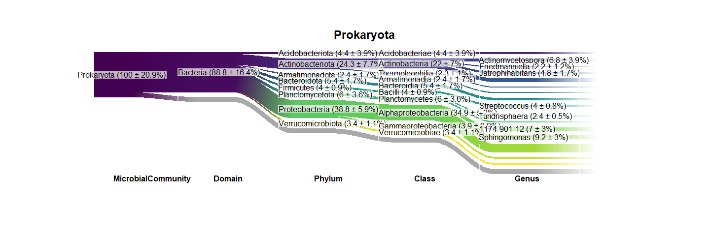

Microbial community composition
================
Jule Freudenthal
2024-05-02

**R version:** 4.3.1 (2023-06-16), Beagle Scouts  
**Packages**

- docstring v. 1.0.0  
- dplyr v. 1.1.4  
- riverplot v. 0.10  
- viridis v. 0.6.5

``` r
# Install packages
if (!require("docstring")) install.packages("docstring")
if (!require("dplyr")) install.packages("dplyr")
if (!require("riverplot")) install.packages("riverplot")
if (!require("viridis")) install.packages("viridis")

# Load packages
library(docstring)
library(dplyr)
library(riverplot)

# Load function
source("Scripts/Functions/RiverplotTransformation.R")
```

We calculate Sankey diagrams to visualize the relative proportion of the
10 most abundant classes and genera of prokaryotes, algae, fungi,
heterotrophic protists, and microscopic metazoa.We only show classes
that constituted more than 1 % of the respective community and genera
that are classified to genus level.

``` r
# Load RNA count- and meta- and taxonomy data
load("Data/PreprocessedData/03CanopyBarkDataTraitsFiltered.rds")

# Check if corresponding row and column names match, else save tables as Data
if(!all(identical(colnames(counts), rownames(metadata)), 
        identical(rownames(counts), rownames(taxonomy)))){
  stop("Corresponding row and column names must match")
}

# Exclude unwanted columns
taxonomy <- taxonomy[,c("MicrobialCommunity", "Domain", 
                        "Phylum", "Class", "Genus")]

# Iterate over the microbial community,
for(SuperDomain in c("Prokaryota", "Eukaryota")){
  
  if(SuperDomain == "Eukaryota"){
    communities <- unique(taxonomy$MicrobialCommunity[taxonomy$MicrobialCommunity != "Prokaryota"])
    height=20
  } else {
    communities <- SuperDomain
    height=6.5
  }
  
  # Create open lists
  c.all <- list()
  t.all <- list()
  
  for(microbial.community in communities){

    # Filter data by microbial community
    c.sub <- counts[taxonomy$MicrobialCommunity == microbial.community,]
    t.sub <- taxonomy[rownames(taxonomy) %in% rownames(c.sub),]
    
    # Normalize counts (relative counts)
    c.sub.norm <- sweep(x = c.sub, MARGIN = 2, STATS = colSums(c.sub), FUN = '/') * 100

    #---------------------------- Summarise counts to most abundant ----------------------------#
    # Summaries counts across all taxonomic level to select 10 most abundant genera
    # Exclude genera that are not classified to genus level
    c.genus <- cbind(t.sub, c.sub) 
    c.genus <- cbind(c.genus, MeanGenus=apply(c.genus[,sapply(c.genus, is.numeric)],1, mean))
    c.genus <- c.genus[order(c.genus$MeanGenus, decreasing = T)[1:10],]
    c.genus <- c.genus[!is.na(c.genus$MicrobialCommunity),]
    c.genus <- c.genus[!grepl("_X", c.genus$Genus),]
    
    # Mark others
    t.sub[!rownames(t.sub) %in% rownames(c.genus),"Genus"] <- "ZZZ"
    
    # Summaries counts across all taxonomic level to select 10 most abundant classes 
    # Classes must constitute more that 1 % of the community
    c.class <- cbind(t.sub[,colnames(t.sub) != "Genus"], c.sub) 
    c.class <- data.frame(summarise_if(group_by_if(c.class, is.character), is.numeric, sum))
    c.class <- cbind(c.class, MeanClass=apply(c.class[,sapply(c.class, is.numeric)],1, mean)/
                       mean(colSums(c.sub))*100)
    c.class <- c.class[order(c.class$MeanClass, decreasing = T)[1:10],]
    c.class <- c.class[!is.na(c.class$MicrobialCommunity),]
    c.class <- c.class[c.class$MeanClass >= 1,]
    t.sub[(!t.sub$Class %in% c.class$Class) & t.sub$Genus == "ZZZ",
          colnames(t.sub)[-1]] <- "ZOthers"
    
    # Assign rownames as ID
    tax.levels <- colnames(t.sub)
    t.sub$ID <- rownames(t.sub)
    
    # Assign mean and sd values
    all <- cbind(t.sub, c.sub)
    for (tax.level in tax.levels) {
      # Summaries counts across all taxonomic level
      c.summed <- data.frame(summarise_if(group_by_at(all, tax.level), is.numeric, sum))
      
      # Calculate Mean an Sd
      c.summed <- 
        setNames(data.frame(c.summed[,tax.level], 
                       round(apply(c.summed[,sapply(c.summed, is.numeric)],1, mean)/
                               mean(colSums(c.sub))*100,1),
                       round(apply(c.summed[,sapply(c.summed, is.numeric)],1, sd)/
                               mean(colSums(c.sub))*100,1)),
                 c(tax.level, paste0(tax.level, c("Mean", "Sd"))))
      
      # Merge
      c.summed <- c.summed[!grepl("ZZZ", c.summed[,tax.level]),]
      t.sub <- merge(t.sub, c.summed, all = T)
    }
    
    # Set ID as rownames
    rownames(t.sub) <- t.sub$ID
    t.sub$ID <- NULL
    
    # Replace "Zothers
    if(microbial.community %in% c("Fungi", "Microscopic Metazoa")){
      t.sub$Domain <- ""
      t.sub$Phylum <- ""
    } 

    # Save in list
    c.all[[microbial.community]] <- c.sub.norm
    t.all[[microbial.community]] <- t.sub
  }
  
  # Merge data
  c.all <- do.call(rbind, c.all)
  t.all <- do.call(rbind, t.all)

  # Transform data
  r <- riverplot.transformation(c.all, 
                                t.all[,c("MicrobialCommunity","Domain","Phylum","Class", "Genus")], 
                                key="Genus", nr.taxa = 50, labels = "names",  order.taxonomic.ranks=F)

  # Adjust nodes labels and edges width
  nodes <- r$nodes[,c("ID", "labels", "TaxonomicLevel")]
  nodes[nodes$labels %in% c("ZZZ", "ZOthers"),"labels"] <- ""
  for (tax.level in tax.levels) {
    # Merge
    n <- merge(nodes[nodes$TaxonomicLevel == tax.level,], 
               unique(t.all[,c(tax.level, paste0(tax.level, c("Mean", "Sd")))]),
               by.x = "labels", by.y = tax.level, all.x = T, all.y = F)
    n[,"labels"] <- 
      paste0(n$labels, " (", n[,paste0(tax.level, "Mean")],
             " ± ", n[,paste0(tax.level, "Sd")],  "%)")
    nodes <- rbind(n[,colnames(nodes)],nodes[nodes$TaxonomicLevel != tax.level,])
  }

  # Delete all labels from you riverplot element
  r$r$nodes$labels <- ""
  
  # Save as png
  pdf(file=paste0("Results/TaxonomicComposition/TaxonomicComposition_",
                  SuperDomain,"_Genus.pdf"), width=12.5, height=height)
  
  # Plot sankey diagram
  coords <- riverplot(r$r, node_margin = 0.1, nodewidth = 5, nsteps = 50, plot_area = 0.90)
  
  # Add lables and title
  nodes <- merge(nodes, coords$nodes[,c("ID", "x", "y")], all.x = T, all.y = F)
  nodes$labels <- sub("^ .*", "", sub("ZOthers", "Others", nodes$labels))
  nodes$labels <- sub("^ .*", "", sub("ZZZ", "", nodes$labels))
  bglabel(x=nodes$x-0.06, y=nodes$y, text=nodes$labels,
                     bg=rep("#FFFFFFB3", length(nodes$y)), margin = 0.1, pos="right")
  text(
    x = unique(coords$nodes$x)[-1],
    y = min(coords$nodes$y)-0.05,
    labels = rev(colnames(taxonomy)),
    pos = 4, offset = 0, font = 2
  )
  title(main = SuperDomain, cex.main = 1.5, line = 0)
  dev.off()
}
```

<!-- -->
<!-- -->
