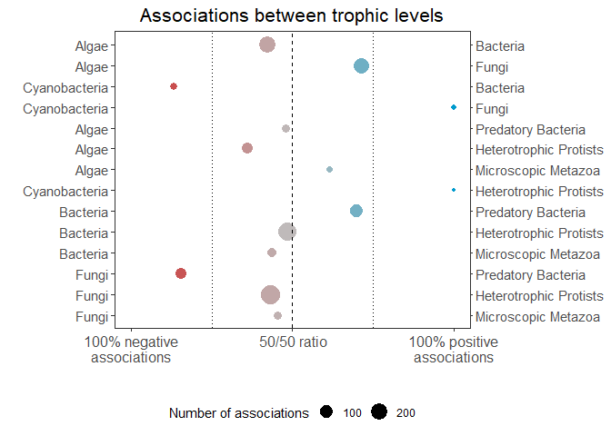
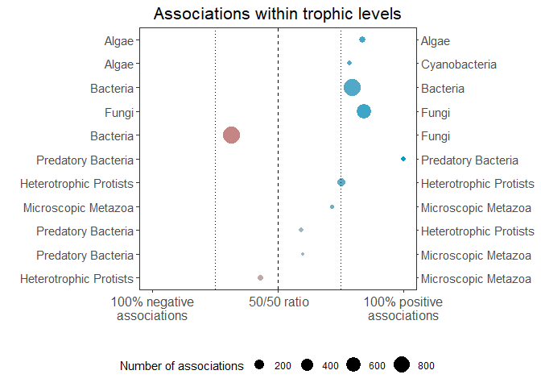
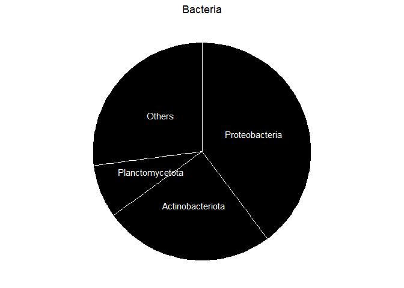
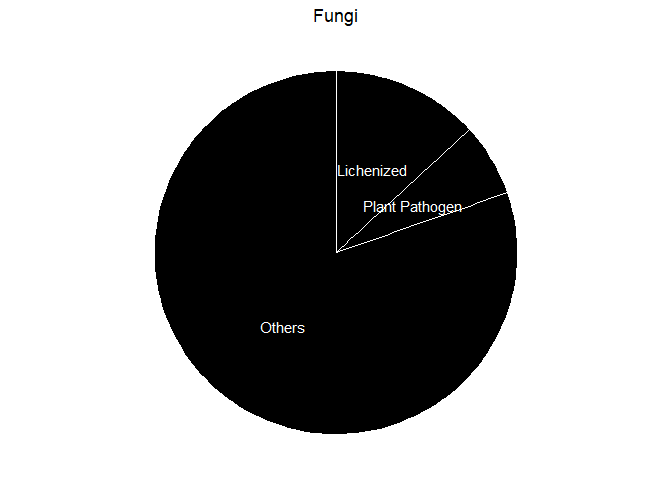
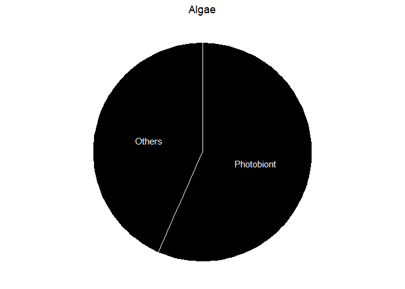
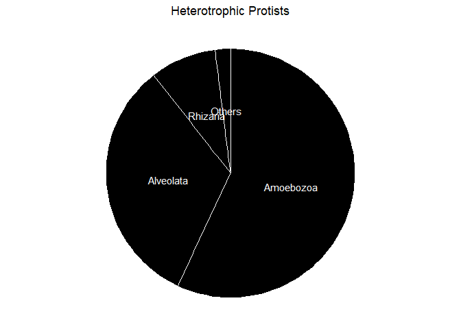
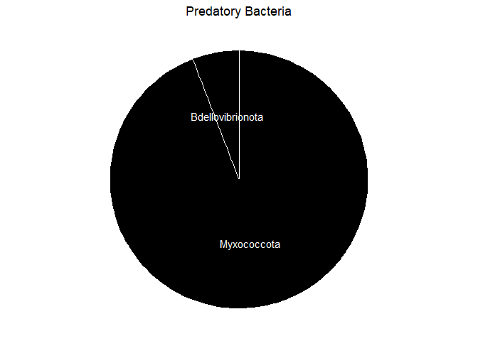
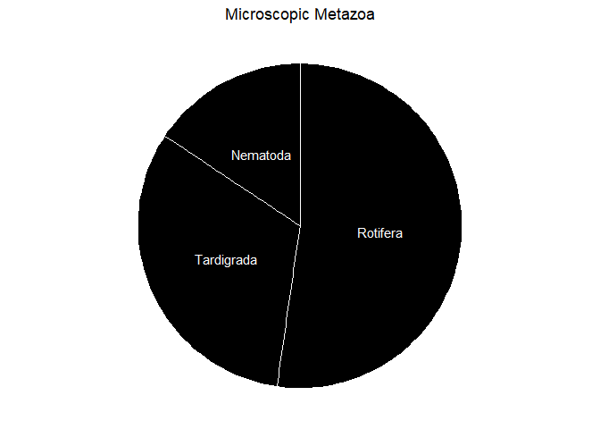
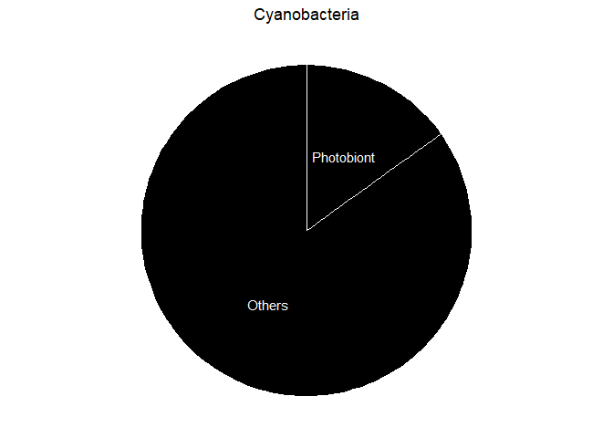

Co-occurrence networks
================
Jule Freudenthal
2024-05-02

**R version:** 4.3.1 (2023-06-16), Beagle Scouts  
**Packages**

- devtools v. 2.4.5  
- ggplot2 v. 3.4.2  
- knitr v. 1.43  
- reshape2 v. 1.4.4  
- rprojroot v. 2.0.3  
- SpiecEasi v. 1.1.2  
- zeallot v. 0.1.0

## 01 Prevalence filter

It has been shown that co-absence can yield high correlation values.
Hence, we only considered genera present in all samples are used for
network calculation. Further we filtered for genera accounting for more
than 0.01 % across all samples. All genera that did not meet the critera
were combined into a pseudo-taxon.

``` r
# Load RNA count- and meta- and taxonomy data
load("Data/PreprocessedData/03CanopyBarkDataTraitsFiltered.rds")

# Filter for most abundant
filter <- 0.0001
print(paste0(sum(rowSums(counts) >= sum(counts)*filter), " out of ", nrow(counts), 
             " genera are kept for further analysis. Only ",
             (sum(counts)-sum(counts[rowSums(counts) >= sum(counts)*filter,]))/sum(counts)*100 ,
             "% of the reads are excluded."))
to_filter <- which(rowSums(counts) < sum(counts)*filter)

# Convert into presence/absence matrix
counts_copy <- counts
counts_copy[counts_copy > 0] <- 1

# Get row sum of each taxon = number of occurrences across samples
to_filter <- unique(sort(c(to_filter,  which(rowSums(counts_copy) != ncol(counts_copy)))))

# Filter count data
counts_filtered <- counts[-to_filter,]

# Get numbers
print(paste("OTUs that are not present in all samples are summed into one pseudo taxon."))
print(paste0(nrow(counts) - nrow(counts_filtered), " out of ", 
             nrow(counts), " OTUs (", 
             round((nrow(counts) - nrow(counts_filtered))/nrow(counts)*100,2),
             "%) are summarised into the pseudo-taxon for network analysis",
             " as they are not present in all samples or are low abundant."))
print(paste0(sum(counts) - sum(counts_filtered), " out of ", 
               sum(counts), " reads (", 
               round((sum(counts) - sum(counts_filtered))/sum(counts)*100,2),
               "%) are summarised into the pseudo-taxon for network analysis",
               " as they al not present in all samples or are low abundant."))

# Bin all filtered taxa to one pseudo taxon
counts_filtered <- rbind(counts_filtered, t(data.frame(filtered_taxa=colSums(counts[to_filter,]))))

# Assign number of Reads, for eukaryotes and prokaryotes separately  
taxonomy$Reads <- rowSums(counts)
taxonomy[taxonomy$MicrobialCommunity=="Prokaryota", "RelReads"] <-
  rowSums(counts[taxonomy$MicrobialCommunity=="Prokaryota",])/
  sum(counts[taxonomy$MicrobialCommunity=="Prokaryota",])*100
taxonomy[taxonomy$MicrobialCommunity!="Prokaryota", "RelReads"] <-
  rowSums(counts[taxonomy$MicrobialCommunity!="Prokaryota",])/
  sum(counts[taxonomy$MicrobialCommunity!="Prokaryota",])*100

# Assign Key column
taxonomy$Key <- rownames(taxonomy)

# Filter taxonomy
taxonomy <- taxonomy[taxonomy$Key %in% rownames(counts_filtered),]

# Replace all NAs with ""
taxonomy[is.na(taxonomy)] <- ""

# Export abundances as txt and csv
write.table(counts_filtered, file = "Data/NetworkData/NetworkData_Genus.txt", 
            sep="\t", quote=FALSE, row.names=TRUE, col.names=NA)
write.table(taxonomy, file = "Results/Networks/NetworkTaxonomy_Genus.csv", 
            row.names=F, quote = F, sep=",", dec = ".")
```

    ## [1] "584 out of 1487 genera are kept for further analysis. Only 3.04625540188299% of the reads are excluded."
    ## [1] "OTUs that are not present in all samples are summed into one pseudo taxon."
    ## [1] "908 out of 1487 OTUs (61.06%) are summarised into the pseudo-taxon for network analysis as they are not present in all samples or are low abundant."
    ## [1] "7553704 out of 239225378 reads (3.16%) are summarised into the pseudo-taxon for network analysis as they al not present in all samples or are low abundant."

## 02 Sparse Inverse Covariance for Ecological Statistical Inference (SPIEC-EASI)

``` r
# Load count- and meta- and taxonomy data
counts <- read.table("Data/NetworkData/NetworkData_Genus.txt", 
                     sep="\t", header = TRUE, row.names = 1)

# Define sparcity threshold 
SparcityThreshold <- 0.001
    
# Step 1: Calculate network
spiec_out <- spiec.easi(t(counts), method='mb', lambda.min.ratio=SparcityThreshold , 
                        nlambda=100, pulsar.params=list(rep.num=20, seed=1244,
                                                       thresh=0.05))

# Save network data
save(spiec_out, file ="Results/Networks/SpiecEasi_Genus.RData")
```

``` r
# Load network data and taxonomy
load("Results/Networks/SpiecEasi_Genus.RData")
taxonomy <- read.table("Results/Networks/NetworkTaxonomy_Genus.csv", header = T,
                       sep=",", dec = ".")

# Step 2: Extract edge weights
betaMat <- as.matrix(symBeta(getOptBeta(spiec_out)))
colnames(betaMat) <- row.names(betaMat) <- colnames(spiec_out$est$data)
betaMat[lower.tri(betaMat, diag = T)] <- 0
    
# Step 3: Transform SPIEC-EASI results for Cytoscape
graph.table <- melt(betaMat)
graph.table <- graph.table[graph.table$value != 0,]
colnames(graph.table) <- c("Node 1", "Node 2", "Edge weights")
    
# Remove binned taxa from table (resulting from prevalence filter)
graph.table <- graph.table[which(!(graph.table$`Node 1` == 'filtered_taxa' | 
                                     graph.table$`Node 2` == 'filtered_taxa')),]

# Get number of negative and positive edges
print("Prevalence filter threshold: 1")
print("Threshold for exploring denser networks: 0.001")
print(paste0("Number of positive edges: ", sum(graph.table$`Edge weights` > 0)))
print(paste0("Number of negative edges: ", sum(graph.table$`Edge weights` < 0)))
print(paste0("Total number of edges: ", nrow(graph.table)))
print(paste0("How far we are from the target stability threshold (0.05): ", 
             getStability(spiec_out)))

# Create new column specifying if correlation is positive or negative
graph.table$Association <- "negative"
graph.table$Association[graph.table$`Edge weights` > 0] <- "positive"

# Create a new column specifying if node are in same functional group or not
algae <- 
  taxonomy[taxonomy$MicrobialCommunity == "Algae" |
             (taxonomy$MicrobialCommunity=="Prokaryota" & 
                taxonomy$Phylum == "Cyanobacteria"),"Key"]
predators <- taxonomy[(taxonomy$MicrobialCommunity %in% 
                        c("Heterotrophic Protists", "Microscopic Metazoa")) |
                        (taxonomy$MicrobialCommunity=="Prokaryota" & 
                           taxonomy$Phylum %in% c("Myxococcota", "Bdellovibrionota")),"Key"]
prey <- taxonomy[!taxonomy$Key %in% c(algae, predators),"Key"]
graph.table$NetworkSubset <- 
  ifelse(graph.table$`Node 1` %in% predators & graph.table$`Node 2` %in% predators,
         "Same", ifelse(graph.table$`Node 1` %in% prey & graph.table$`Node 2` %in% prey,
                        "Same", ifelse(graph.table$`Node 1` %in% algae & graph.table$`Node 2` %in% algae,
                                       "Same", "Different")))

# Export data as txt file
write.table(graph.table, file = "Results/Networks/SpiecEasi_Genus.txt",
            sep="\t", quote=FALSE, row.names=FALSE)
```

    ## [1] "Prevalence filter threshold: 1"
    ## [1] "Threshold for exploring denser networks: 0.001"
    ## [1] "Number of positive edges: 2320"
    ## [1] "Number of negative edges: 1616"
    ## [1] "Total number of edges: 3936"
    ## [1] "How far we are from the target stability threshold (0.05): 0.0492951581204217"

# 03 Summarize network

For network visualization, we summarized the number of associations and
the ratio of positive to negative associations for primary producers,
decomposers and consumers as well as for microbial groups, i.e algae and
cyanobacteria, fungi, other bacteria, predatory bacteria, protists and
microscopic metazoans.

``` r
# Load count- and meta- and taxonomy data
network <- read.table("Results/Networks/SpiecEasi_Genus.txt", 
                     sep="\t", header = TRUE)
taxonomy <- read.table("Results/Networks/NetworkTaxonomy_Genus.csv", header = T,
                       sep=",", dec = ".")

# Adjust microbial groups 
taxonomy[taxonomy$Phylum == "Cyanobacteria","MicrobialCommunity"] <- "Cyanobacteria"
taxonomy[taxonomy$Phylum %in% 
           c("Myxococcota", "Bdellovibrionota"),"MicrobialCommunity"] <- "Predatory Bacteria"
taxonomy$MicrobialCommunity <- sub("Prokaryota", "Bacteria", taxonomy$MicrobialCommunity)

# Subset taxonomy
taxonomy=taxonomy[,c("MicrobialCommunity", "Lichen", "Key", "Reads", "RelReads")]

# Calculate frequencies per Microbial Community and Functional group
c(edge.table, tax.table) %<-% 
    association.frequencies(edge.table=network[,!colnames(network) %in% c("Association", "NetworkSubset")],
                            taxonomy=taxonomy, old.key = "Key", new.key="MicrobialCommunity")

# log transform number of reads
tax.table$LogReads <- log(tax.table$Reads)
tax.table$LogRelReads <- log(tax.table$RelReads+1)

# Delete Key column (taxonomy) and number from Nodes
tax.table$Key <- NULL
edge.table$Node.1 <- sub(".*_", "", edge.table$Node.1)
edge.table$Node.2 <- sub(".*_", "", edge.table$Node.2)

# Sort Nodes alphabetically
for (row in seq(nrow(edge.table))) {
  nodes <- sort(c(edge.table[row,"Node.1"], edge.table[row,"Node.2"]))
  edge.table[row,"Node.1"] <- nodes[1]
  edge.table[row,"Node.2"] <- nodes[2]
}

# Assign percentage negative vs. positive edges
edge.table$Node <- paste(edge.table$Node.1, edge.table$Node.2, sep = " & ")
edge.table$Pct <- 0
edge.table$`Number of associations` <- 0

for(node in unique(edge.table$Node)){
  if(sum(edge.table$Node == node)==1){
    edge.table <- rbind(edge.table, 
          setNames(data.frame(edge.table[edge.table$Node == node,c(1:2)],
                     ifelse(edge.table[edge.table$Node == node,3]=="positive","negative","positive"),
                     0, edge.table[edge.table$Node == node,5], 0, 0),colnames(edge.table)))
  }
  edge.table[edge.table$Node == node,"Pct"] <- 
    round(edge.table[edge.table$Node == node,"Edge.weights"]/
            sum(edge.table[edge.table$Node == node,"Edge.weights"])*100,1)
  edge.table[edge.table$Node == node,"Number of associations"] <-
    sum(edge.table[edge.table$Node == node,"Edge.weights"])
}

edge.table <- edge.table[edge.table$Association == "positive",]
edge.table$Association <- NULL
edge.table$Node <- NULL
edge.table$Edge.weights <- NULL

# Export data as txt file
write.table(edge.table, file = "Results/Networks/SpiecEasi_Groups.txt",
            sep="\t", quote=FALSE, row.names=FALSE)
write.table(tax.table, file = "Results/Networks/SpiecEasi_Taxonomy_Groups.txt",
            sep="\t", quote=FALSE, row.names=FALSE)
```

Additionally, we show the summarized number of associations number of
associations (point size) and the ratio of positive to negative
associations (point color) also as point graph.

``` r
# Load count- and meta- and taxonomy data
network <- read.table("Results/Networks/SpiecEasi_Genus.txt", 
                     sep="\t", header = TRUE)
taxonomy <- read.table("Results/Networks/NetworkTaxonomy_Genus.csv",
                       sep=",", dec = ".",header = TRUE)

# Add new column indicating functional group
taxonomy$FunctionalGroup <- ""
taxonomy$FunctionalGroup[taxonomy$MicrobialCommunity %in% 
                         c("Heterotrophic Protists", "Microscopic Metazoa") | 
                         (taxonomy$MicrobialCommunity == "Prokaryota" &
                            taxonomy$Phylum %in% c("Myxococcota", "Bdellovibrionota"))] <- "03SC"
taxonomy$FunctionalGroup[taxonomy$MicrobialCommunity == "Fungi" | 
                    (taxonomy$MicrobialCommunity == "Prokaryota" &
                       (!taxonomy$Phylum %in% 
                          c("Myxococcota", "Bdellovibrionota", "Cyanobacteria")))] <- "02PC"
taxonomy$FunctionalGroup[taxonomy$MicrobialCommunity == "Algae" |
                    (taxonomy$MicrobialCommunity == "Prokaryota" & 
                       taxonomy$Phylum == "Cyanobacteria")] <- "01PP"

# Add numbers to the microbial community
taxonomy$MicrobialCommunity <- 
  sub("Microscopic Metazoa", "05Microscopic Metazoa", 
      sub("Heterotrophic Protists", "04Heterotrophic Protists", 
          sub("Fungi", "03Fungi", 
              sub("Prokaryota", "02Prokaryota", 
                  sub("Algae", "01Algae", taxonomy$MicrobialCommunity)))))

# Subset taxonomy to wanted columns
taxonomy <- taxonomy[,c("MicrobialCommunity", "FunctionalGroup", "Key", "RelReads")]

# Adjust names 
taxonomy[grepl("Prokaryota", taxonomy$MicrobialCommunity) &
           taxonomy$FunctionalGroup == "01PP","MicrobialCommunity"] <- "02Cyanobacteria"
taxonomy[grepl("Prokaryota", taxonomy$MicrobialCommunity) &
           taxonomy$FunctionalGroup == "03SC","MicrobialCommunity"] <- "02Predatory Bacteria"
taxonomy$MicrobialCommunity <- sub("Prokaryota", "Bacteria", taxonomy$MicrobialCommunity)

# Calculate frequencies per Microbial Community and Functional group
c(edge.table, tax.table) %<-% 
    association.frequencies(edge.table=network[,!colnames(network) %in% c("Association", "NetworkSubset")],
                            taxonomy=taxonomy, old.key = "Key", new.key="MicrobialCommunity")


# Add new node column
taxonomy$Nodes <-  paste0(taxonomy$FunctionalGroup, ": ", taxonomy$MicrobialCommunity)

# Assign functional group and microbial community to nodes
edge.table <- merge(edge.table, tax.table, by.x = "Node.1", by.y = "Key", all.x = T, all.y = F)
edge.table$Node.1 <- paste0(edge.table$FunctionalGroup, ": ", edge.table$MicrobialCommunity)
edge.table <- edge.table[,c("Node.1", "Node.2", "Association", "Edge.weights")]
edge.table <- merge(edge.table, tax.table, by.x = "Node.2", by.y = "Key", all.x = T, all.y = F)
edge.table$Node.2 <- paste0(edge.table$FunctionalGroup, ": ", edge.table$MicrobialCommunity)
edge.table <- edge.table[,c("Node.1", "Node.2", "Association", "Edge.weights")]

# Sort Nodes alphabetically
for (row in seq(nrow(edge.table))) {
  nodes <- sort(c(edge.table[row,"Node.1"], edge.table[row,"Node.2"]))
  edge.table[row,"Node.1"] <- nodes[1]
  edge.table[row,"Node.2"] <- nodes[2]
}

# Assign percentage negative vs. positive edges
edge.table$Node <- paste(edge.table$Node.1, edge.table$Node.2, sep = " & ")
for(node in unique(edge.table$Node)){
  edge.table[edge.table$Node == node,"Pct"] <- 
    round(edge.table[edge.table$Node == node,"Edge.weights"]/
            sum(edge.table[edge.table$Node == node,"Edge.weights"])*100,1)
  edge.table[edge.table$Node == node,"Number of associations"] <-
    sum(edge.table[edge.table$Node == node,"Edge.weights"])
}

# Order table
edge.table$Node <- 
  ifelse(edge.table$Node.1 == edge.table$Node.2, edge.table$Node.1, 
         paste0(sub(":.*", "", edge.table$Node.1), 
                sub(":.*", "", edge.table$Node.2), ": ", 
                sub(".*: ", "", edge.table$Node.1), " & ",
                sub(".*: ", "", edge.table$Node.2)))
edge.table <- edge.table[order(edge.table$Node),]

# Get only positive associations
edge.table <- edge.table[edge.table$Association =="positive",]

library(RColorBrewer)
color.gradient <- function(x, colors, colsteps=100) {
  return( colorRampPalette(colors) (colsteps) [ findInterval(x, seq(min(x),max(x), length.out=colsteps)) ] )
}
colors <- data.frame(Pct=as.character(seq(from = 0, to = 100, length.out = 1001)), 
                 Colors=color.gradient(seq(from = 0, to = 100, length.out = 1001), 
                                       colors = c("firebrick3", "grey75", "deepskyblue3")))

#  Add percenages
edge.table$Pct <- as.character(edge.table$Pct)
edge.table <- merge(edge.table, colors, all.x = T, all.y = F, by="Pct")
edge.table$Pct <- as.numeric(edge.table$Pct)

#-------------- Associations between trophic levels
edges <- edge.table

# Exclude associations within trophic level
edges <- edges[!(grepl("PP", edges$Node.1) & grepl("PP", edges$Node.2)),] 
edges <- edges[!(grepl("PC", edges$Node.1) & grepl("PC", edges$Node.2)),] 
edges <- edges[!(grepl("SC", edges$Node.1) & grepl("SC", edges$Node.2)),] 

#
edges <- edges[order(edges$Node, decreasing = T),]
edges$Node <- factor(edges$Node, level=edges$Node)

# Visualization
g1 <- ggplot(data=edges, aes(x=Pct, y=as.numeric(Node), color=Node, size=`Number of associations`)) +
  geom_point() +
  labs(x="", y="", 
       title =  "Associations between trophic levels")  +
  scale_y_continuous(breaks=seq(nrow(edges)), 
                     labels=gsub(".*: |[0-9]", "", edges$Node.1),
                     sec.axis = sec_axis(~.,
                                         breaks = seq(nrow(edges)),
                                         labels = gsub(".*: |[0-9]", "", edges$Node.2))) +
  scale_x_continuous(limits = c(0,100), breaks=c(0,50,100), 
                     labels=c("100% negative\nassociations"," 50/50 ratio","100% positive\nassociations")) +
  scale_color_manual(values=edges$Colors, guide="none") +
  scale_size_continuous(range = c(1, 7)) +
  geom_vline(xintercept=c(25, 50, 75), linetype=c("dotted", "dashed","dotted")) +
  theme_bw() +
  theme(axis.text.x = element_text(size = 12, angle = 0),
        axis.text.y = element_text(size = 11, angle = 0),
        plot.title = element_text(size = 16, hjust = 0.5),
        panel.grid.major = element_blank(), 
        panel.grid.minor = element_blank(),
        legend.position = "bottom")

print(g1)

#-------------- Associations within trophic levels
edges <- edge.table

# Select associations within trophic level
edges <- edges[c(which(grepl("PP", edges$Node.1) & 
                         grepl("PP", edges$Node.2)),
                 which(grepl("PC", edges$Node.1) & 
                         grepl("PC", edges$Node.2)),
                 which(grepl("SC", edges$Node.1) & 
                         grepl("SC", edges$Node.2))),] 

#
edges <- edges[order(edges$Node, decreasing = T),]
edges$Node <- factor(edges$Node, level=edges$Node)

# Visualization
g2 <- ggplot(data=edges, aes(x=Pct, y=as.numeric(Node), color=Node, size=`Number of associations`)) +
  geom_point() +
  labs(x="", y="", 
       title =  "Associations within trophic levels")  +
  scale_y_continuous(breaks=seq(nrow(edges)), 
                     labels=gsub(".*: |[0-9]", "", edges$Node.1),
                     sec.axis = sec_axis(~.,
                                         breaks = seq(nrow(edges)),
                                         labels = gsub(".*: |[0-9]", "", edges$Node.2))) +
  scale_x_continuous(limits = c(0,100), breaks=c(0,50,100), 
                     labels=c("100% negative\nassociations"," 50/50 ratio","100% positive\nassociations")) +
  scale_color_manual(values=edges$Colors, guide="none") +
  scale_size_continuous(range = c(1, 7)) +
  geom_vline(xintercept=c(25, 50, 75), linetype=c("dotted", "dashed","dotted")) +
  theme_bw() +
  theme(axis.text.x = element_text(size = 12, angle = 0),
        axis.text.y = element_text(size = 11, angle = 0),
        plot.title = element_text(size = 16, hjust = 0.5),
        panel.grid.major = element_blank(), 
        panel.grid.minor = element_blank(),
        legend.position = "bottom")

print(g2)

# Export for visulaization
edges <- edge.table[,c("Node.1", "Node.2", "Number of associations", "Pct")]
edges$Node.1 <- gsub(".*: |[0-9]", "", edges$Node.1)
edges$Node.2 <- gsub(".*: |[0-9]", "", edges$Node.2)
```



## 04 Pie charts

Lastly, we create pie charts for each microbial group to show the
community composition.

``` r
# Load count- and meta- and taxonomy data
network <- read.table("Results/Networks/SpiecEasi_Genus.txt", 
                     sep="\t", header = TRUE)
taxonomy <- read.table("Results/Networks/NetworkTaxonomy_Genus.csv",
                       sep=",", dec = ".",header = TRUE)

# Define for which taxonomic level the pie chart  is created
taxonomy$TaxRank <- ifelse(taxonomy$MicrobialCommunity == "Prokaryota" , taxonomy$Phylum, 
       ifelse(taxonomy$MicrobialCommunity == "Heterotrophic Protists", taxonomy$Domain, 
              ifelse(taxonomy$MicrobialCommunity == "Microscopic Metazoa", taxonomy$Class, 
                     ifelse(taxonomy$MicrobialCommunity == "Fungi", taxonomy$Lifestyle, taxonomy$Lichen))))

# Adjust names 
taxonomy[taxonomy$Phylum == "Cyanobacteria","TaxRank"] <- 
  taxonomy[taxonomy$Phylum == "Cyanobacteria","Lichen"]
taxonomy[taxonomy$Phylum == "Cyanobacteria","MicrobialCommunity"] <- "Cyanobacteria"
taxonomy[taxonomy$Phylum %in% 
           c("Myxococcota", "Bdellovibrionota"),"MicrobialCommunity"] <- "Predatory Bacteria"
taxonomy$MicrobialCommunity <- sub("Prokaryota", "Bacteria", taxonomy$MicrobialCommunity)
taxonomy[taxonomy$Lifestyle == "Lichen Parasite", "TaxRank"] <- ""
taxonomy[taxonomy$TaxRank == "","TaxRank"] <- "Others"

#taxonomy[taxonomy$Lichen == "Photobiont","MicrobialCommunity"] <- "Photobiont"
#taxonomy[taxonomy$Lichen == "Mycobiont","MicrobialCommunity"] <- "Mycobiont"
#

# Subset taxonomy
taxonomy=taxonomy[,c("MicrobialCommunity", "TaxRank", "Key", "Reads", "RelReads")]

# Calculate frequencies per Microbial Community and Functional group
c(edge.table, tax.table) %<-% 
    association.frequencies(edge.table=network[,!colnames(network) %in%
                                                 c("Association", "NetworkSubset")],
                            taxonomy=taxonomy, old.key = "Key", new.key="TaxRank")

# Order nr. of reads
tax.table <- tax.table[order(tax.table$Reads, decreasing = T),]

# Loop over microbial community
for (microbial.group in unique(tax.table$MicrobialCommunity)) {

  tax.sub <- tax.table[tax.table$MicrobialCommunity==microbial.group,]
  if(nrow(tax.sub) > 3){
    tax.sub$TaxRank[4:nrow(tax.sub)] <- "Others"
  }
  
  levels <- unique(tax.sub$TaxRank)
  levels <- c(levels[levels!="Others"],levels[levels=="Others"])
  
  # Add label position
  tax.sub <- data.frame(tax.sub %>% 
    group_by(TaxRank) %>%
    summarise_if(is.numeric, sum))
  
  tax.sub$TaxRank <- factor(tax.sub$TaxRank, levels = levels)
  tax.sub <- tax.sub[order(tax.sub$TaxRank),]
      
  labels <- tax.sub %>%
    arrange(desc(TaxRank)) %>%
    mutate(cumsum = cumsum(Reads),
           mid = Reads/2,
           pos = cumsum - mid,
           prop = paste0(100*round(Reads/sum(Reads), 2), "%"))

  
  # Plot
  g <- ggplot(tax.sub, aes(x = "x", y = Reads, fill = TaxRank)) +
    geom_bar(stat = "identity", position = "stack", color = "white", linewidth = 0.7) +  
    labs(title=microbial.group) +
    geom_text(data = labels, aes(x = "x", y = pos, label = TaxRank), color = "white") +
    coord_polar(theta = "y", direction = -1, clip = "off") +
    scale_fill_manual(name = NULL, values=rep("black", nrow(tax.sub)), guide="none") +  
    theme_void() +
    theme(plot.title = element_text(hjust = 0.5))
  print(g)
  
  ggsave(paste0("Results/Networks/Pie_", microbial.group, ".pdf"), g, width = 1.5, height = 1.5)
}
```


