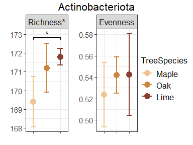
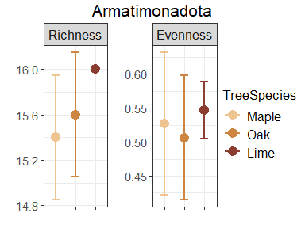
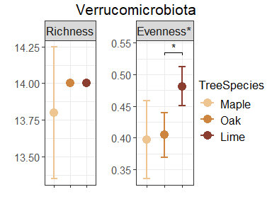

Alpha diversity
================
Jule Freudenthal
2024-05-02

**R version:** 4.3.1 (2023-06-16), Beagle Scouts  
**Packages**

- dplyr v. 1.1.4  
- ggplot2 v. 3.5.0  
- ggsignif v. 0.6.4  
- ggpubr v. 0.6.0  
- reshape2 v. 1.4.4  
- rstatix v. 0.7.2  
- vegan v. 2.6-4

## 01 Select microbial groups

To explore the diversity among the three tree species, we compared the
whole community as well as the 10 most abundant classes (fungi and
microscopic metazoans) or domains (protists and algae) of the eukaryotes
and the 10 most abundant phyla of the prokaryotes. We only consider
classes/domains/phyla that are represented by at least 10 genera.

``` r
# Create a data frame for the statistic 
statistic <- setNames(data.frame(matrix(ncol = 5, nrow = 0)),
                      c("MicrobialCommunity", "Factor", "Index", "p", "p.signif"))

# Load RNA count- and meta- and taxonomy data
load("Data/PreprocessedData/03CanopyBarkDataTraitsFiltered.rds")

#-------------------------- Get indices for most abundant groups ---------------------#
# Check if corresponding row and column names match, else save tables as Data
if(!all(identical(colnames(counts), rownames(metadata)), 
        identical(rownames(counts), rownames(taxonomy)))){
  stop("Corresponding row and column names must match")
}

# Get indices for most abundant groups
indices <- 
  list(WholeCommunity=seq(nrow(taxonomy)),
       Eukaryota=which(taxonomy$MicrobialCommunity!="Prokaryota"))

for(group in c("Microscopic Metazoa", "Heterotrophic Protists", "Fungi", "Prokaryota", "Algae")){
  Rank=ifelse(group %in% c("Microscopic Metazoa", "Fungi"), "Class",
         ifelse(group %in% c("Heterotrophic Protists", "Algae"), "Domain", "Phylum"))
  
  Taxa=data.frame(data.frame(Rank=taxonomy[taxonomy$MicrobialCommunity==group, Rank],
        Reads=rowSums(counts[taxonomy$MicrobialCommunity==group,])) %>%
    group_by(Rank) %>%
    summarise_all(sum) %>%
    arrange(desc(Reads)))$Rank
  
  if(length(Taxa)>10){
    Taxa=Taxa[1:10]
  }
  
  if(group == "Algae"){
    Taxa=paste0("Algae", Taxa)
  }
  
  indices <- c(indices, list(which(taxonomy$MicrobialCommunity==group)))
  names(indices)[[length(indices)]] <- group
  
  if(group == "Prokaryota"){
    indices <- c(indices, list(which(taxonomy$Domain=="Bacteria")))
    names(indices)[[length(indices)]] <- "Bacteria"
  }
  
  indices <- 
    c(indices, sapply(Taxa, function(x) which(taxonomy$MicrobialCommunity==group & 
                                                taxonomy[,Rank]==sub("^Algae", "", x))))
}

# Select only taxa that are present in 10 or more samples
indices <- indices[sapply(indices, function(x) length(x)) >= 10]
```

## 02 Alpha Diversity

We calculate the genus richness and Pielou’s Evenness and test for
significant differences among tree species using a Kruskal-Wallis test
and Wilcoxon post-hoc test with multiple comparisons correction
according to Benjamini & Hochberg.

``` r
# Define distance between significance stars in plot
d <- 0.13 # For big plots
#d <- 0.22 # For small plots

# Iterate over the microbial community
for(index.microbial.community in seq(length(indices))){
  
  # Filter data by microbial community and transpose count data
  counts.sub <- counts[indices[[index.microbial.community]],]
  counts.transposed <- t(counts.sub)
  
  # Get name of microbial community
  microbial.community <- paste0(sprintf("%02d", index.microbial.community),
                                names(indices)[index.microbial.community])
  
  #------------------------------ Calculate Alpha Diversity ---------------------------#
  # Calculate genus richness and evenness
  alpha <- setNames(data.frame(specnumber(counts.transposed)), "Richness")
  alpha <- setNames(merge(alpha, data.frame(diversity(counts.transposed, index = "shannon")), 
                             by=0, all = T), c("SampleID", "Richness", "Shannon"))
  alpha$Evenness <- alpha$Shannon/log(alpha$Richness)
  alpha$Shannon <- NULL

  # Assign column Tree Species
  alpha$TreeSpecies <- metadata[match(alpha$SampleID, metadata$SampleID),"TreeSpecies"] 
  
  # Adjust names of tree species
  alpha$TreeSpecies <- sub("Acer pseudoplatanus", "Maple", 
                           sub("Quercus robur", "Oak", 
                               sub("Tilia cordata", "Lime", alpha$TreeSpecies)))
  
  #--------------------------- Test for significant differences -----------------------#
  # Perform kruskal test
  kruskal <- 
    setNames(data.frame(alpha %>%
                          gather(key = "variable", value = "value",Richness, Evenness) %>%
                          group_by(variable) %>% 
                          kruskal_test(value ~ TreeSpecies) %>%
                          select(variable, p)), c("Index", "p"))
  # Add column indicating significance
  kruskal$p.signif <- 
    ifelse(kruskal$p < 0.001, "***", 
           ifelse(kruskal$p < 0.01, "**", 
                  ifelse(kruskal$p < 0.05, "*","")))

  # Add column for microbial community and factor
  kruskal <- cbind(MicrobialCommunity=microbial.community, Factor="TreeSpecies", kruskal)
  
  # Save in overall table
  statistic <-  merge(statistic, kruskal, all = T)
  
  #-------------------------- Post-hoc test ~ pairwise comparison ---------------------#
  # Reshape from wide to long        
  alpha <- setNames(melt(alpha,id.vars=c("SampleID", "TreeSpecies")), 
                    c("SampleID", "TreeSpecies", "Index", "AlphaValue"))
  
  # Perform wilcox_test_test
  if(any(kruskal[,"p"] < 0.05)){
    tryCatch(
      {
        # Only for significant results of the kruskal test
        wilcox_test <- data.frame(alpha[alpha$Index %in% kruskal$Index[kruskal[,"p"] < 0.05],] %>% 
                                     group_by(Index) %>% 
                                     wilcox_test(AlphaValue ~ TreeSpecies, p.adjust.method = "BH")%>%
                                     select(Index, group1, group2, p.adj, p.adj.signif))
        

        # Save in overall table
        statistic <-  merge(statistic, 
                            cbind(MicrobialCommunity=microbial.community,
                                  Factor=paste(wilcox_test$group2, wilcox_test$group1, sep = " vs. "), 
                                  setNames(wilcox_test[,c("Index", "p.adj", "p.adj.signif")],
                                   c("Index", "p", "p.signif"))), all = T)
      },
      error=function(cond) {
        message(paste("wilcox_test could no be calculated for ", microbial.community))
      }
    )

  }
  
  # select only significant p values
  wilcox_test <- wilcox_test[wilcox_test$p.adj < 0.05,]

  #------------------------------ Visualize Alpha Diversity ---------------------------#
  # Add title to kruskal test
  kruskal$Title <- paste0(kruskal$Index, kruskal[,paste0("p", ".signif")]) 
  
  # Calculate mean and SD
  alpha <- alpha[,c("Index", "TreeSpecies","AlphaValue")] %>% 
    group_by(Index, TreeSpecies) %>% 
    summarise(Mean = mean(AlphaValue), SD = sd(AlphaValue))

  # Combine alpha values and statistic test results
  alpha <- merge(alpha, 
                 kruskal[,c("Index","Title")],
                 by="Index", all = T)
  
  # Order table, define order of Tree species, indices, and title
  alpha$TreeSpecies <- factor(alpha$TreeSpecies, levels = c("Maple", "Oak", "Lime"))
  alpha$Index <- factor(alpha$Index, levels = c("Richness", "Evenness"))
  alpha <- alpha[order(alpha$Index),]
  alpha$Title <- factor(alpha$Title, levels=unique(alpha$Title))
  
  # Create open lists for plots
  all.plots <- list()
  all.plots.no.lables <- list()

  # Create plot per alpha diversity index
  for (i in levels(alpha$Index)){
    
    # Subset alpha diversity and wilcox test
    a <- alpha[alpha$Index == i,]
    wilcox <- wilcox_test[wilcox_test$Index == i,]
  
    # Plot alpha diversity indices
    g <- ggplot(a, aes(x = TreeSpecies, y = Mean, color = TreeSpecies)) +
      geom_point(size=4) + 
      geom_errorbar(aes(x=TreeSpecies, ymin=Mean-SD, ymax=Mean+SD), width=0.4, linewidth=1) +
      facet_wrap(~Title)  +
      labs(x = "", y = "") +
      scale_color_manual(values = c("burlywood2", "tan3", "coral4")) +
      theme_bw() +
      theme(strip.text = element_text(size = 13),
            legend.title = element_text(size = 13),
            legend.text = element_text(size = 12),
            axis.text.x = element_blank(),
            axis.text.y = element_text(size = 11),
            plot.margin = margin(0.1,0.03,0.1,0.03, "cm")) 

    # Check if significant differences exist
    if(nrow(wilcox) != 0){
      
      # Add y position to wilcox test
      y_range <- layer_scales(g)$y$range$range
      wilcox$y <- 0
      
      for (row in seq(nrow(wilcox))){
        wilcox$y[row] <- 
          max(a[a$TreeSpecies %in% c(wilcox$group1[row], wilcox$group2[row]),"Mean"] +
          a[a$TreeSpecies %in% c(wilcox$group1[row], wilcox$group2[row]),"SD"]) +
          (y_range[2]-y_range[1])*d
        if(wilcox$y[row] %in% wilcox$y[-row]){
          wilcox$y[row] <- wilcox$y[row]+(y_range[2]-y_range[1])*d
        }
      }
      
      if(nrow(wilcox) > 1){
        wilcox <- wilcox[order(wilcox$y),]
        for (row in seq(nrow(wilcox))[-1]){
          if(((y_range[2]-y_range[1])*d) > (wilcox$y[row]-wilcox$y[row-1])){
            wilcox$y[row] <- 
              wilcox$y[row]+((y_range[2]-y_range[1])*d) - (wilcox$y[row]-wilcox$y[row-1])
          }
        }
      }
        
      # Add significances to plot
      g <- g +  geom_signif(col ="black",annotations=wilcox$p.adj.signif, y_position=wilcox$y, 
                           xmin=wilcox$group2, xmax=wilcox$group1,
                           tip_length=0.02) +
        ylim(c(y_range[1], max(c(wilcox$y, y_range[2]))+
                 (y_range[2]-y_range[1])*0.05))#big=0.05, small=0.12
    }

    # Save plot in list
    all.plots[[i]] <- g
    
    # Save one version with no labels
    g=g + theme(axis.text.y = element_blank())
    all.plots.no.lables[[i]] <- g
  }

  # Define title
  title <-gsub("AlgaeA", "A", gsub("WholeC", "Whole C", gsub("[0-9]", "", microbial.community)))
  
  # Arrange plots
  g <- ggarrange(plotlist = all.plots, ncol = 2, common.legend = T, legend="right") 
  g <- annotate_figure(g, top = text_grob(title, size = 16)) +
    theme(plot.background = element_rect(fill="white", color = NA))
  print(g)

  # Reset wilcox dataframe
  wilcox_test <- wilcox_test[0,]

  # Save graph as plot
  ggsave(paste0("Results/AlphaDiversity/AlphaDiversity_", microbial.community, ".pdf"), 
         plot = g,width = 3, height = 2.7)
  #ggsave(paste0("Results/AlphaDiversity/AlphaDiversity_", microbial.community, "_Appendix.pdf"), 
  #       plot = g, width = 3.15, height = 2)
  
  # Save plots also without lables
  g <- ggarrange(plotlist = all.plots.no.lables, ncol = 2, common.legend = T, legend="none") 
  g <- annotate_figure(g, top = text_grob(title, size = 16)) +
    theme(plot.background = element_rect(fill="white", color = NA))

  # Save graph as plot
  ggsave(paste0("Results/AlphaDiversity/AlphaDiversity_", microbial.community, "_NL.pdf"), 
         plot = g, width = 3, height = 2.7)
  #ggsave(paste0("Results/AlphaDiversity/AlphaDiversity_", microbial.community, "NL_Appendix.pdf"), 
  #       plot = g, width = 3.15, height = 2)

}

# Export statistic
statistic$Factor <- sub("Oak vs. Maple", "Maple vs. Oak", statistic$Factor)
write.table(statistic, "Results/AlphaDiversity/AlphaDiversity_Statistic.txt",
            col.names = T, row.names = F, sep = "\t", dec = ".", quote = F)
```


