Beta diversity
================
Jule Freudenthal
2024-05-02

**R version:** 4.3.1 (2023-06-16), Beagle Scouts  
**Packages**

- devtools v. 2.4.5  
- dplyr v. 1.1.4  
- ggalt v. 0.4.0  
- ggplot2 v. 3.5.0  
- ggrepel v. 0.9.5  
- pairwiseAdonis v. 0.4.1  
- vegan v. 2.6-4

## 01 Select microbial groups

To explore the diversity among the three tree species, we compared the
whole community as well as the 10 most abundant classes (fungi and
microscopic metazoans) or domains (protists and algae) of the eukaryotes
and the 10 most abundant phyla of the prokaryotes. We only consider
classes/domains/phyla that are represented by at least 10 genera.

``` r
# Load RNA count- and meta- and taxonomy data
load("Data/PreprocessedData/03CanopyBarkDataTraitsFiltered.rds")

#-------------------------- Get indices for most abundant groups ---------------------#
# Check if corresponding row and column names match, else save tables as Data
if(!all(identical(colnames(counts), rownames(metadata)), 
        identical(rownames(counts), rownames(taxonomy)))){
  stop("Corresponding row and column names must match")
}

# Get indices for most abundant groups
indices <- 
  list(WholeCommunity=seq(nrow(taxonomy)),
       Eukaryota=which(taxonomy$MicrobialCommunity!="Prokaryota"))

for(group in c("Microscopic Metazoa", "Heterotrophic Protists", "Fungi", "Prokaryota", "Algae")){
  Rank=ifelse(group %in% c("Microscopic Metazoa", "Fungi"), "Class",
         ifelse(group %in% c("Heterotrophic Protists", "Algae"), "Domain", "Phylum"))
  
  Taxa=data.frame(data.frame(Rank=taxonomy[taxonomy$MicrobialCommunity==group, Rank],
        Reads=rowSums(counts[taxonomy$MicrobialCommunity==group,])) %>%
    group_by(Rank) %>%
    summarise_all(sum) %>%
    arrange(desc(Reads)))$Rank
  
  if(length(Taxa)>10){
    Taxa=Taxa[1:10]
  }
  
  if(group == "Algae"){
    Taxa=paste0("Algae", Taxa)
  }
  
  indices <- c(indices, list(which(taxonomy$MicrobialCommunity==group)))
  names(indices)[[length(indices)]] <- group
  
  if(group == "Prokaryota"){
    indices <- c(indices, list(which(taxonomy$Domain=="Bacteria")))
    names(indices)[[length(indices)]] <- "Bacteria"
  }
  
  indices <- 
    c(indices, sapply(Taxa, function(x) which(taxonomy$MicrobialCommunity==group & 
                                                taxonomy[,Rank]==sub("^Algae", "", x))))
}

# Select only taxa that are present in 10 or more samples
indices <- indices[sapply(indices, function(x) length(x)) >= 10]

# Normalize counts (relative counts)
counts <- sweep(x = counts, MARGIN = 2, STATS = colSums(counts), FUN = '/')
```

## 02 Beta diversity

We perform non-metric multidimensional scaling (NMDS) based on
Bray-Curtis dissimilarity for algae, bacteria, fungi, protists, and
microscopic metazoa. Additionally, we fitted the relative abundance of
the microbial groups and of the respective 10 most abundant genera that
could be classified to the genus level onto the ordinations. For
significant correlations of the microbial groups, we write the tree with
the highest abundance to a table.

``` r
# Load RNA count- and meta- and taxonomy data 
load("Data/PreprocessedData/03CanopyBarkDataTraitsFiltered.rds")

# Check if corresponding row and column names match, else save tables as Data
if(!all(identical(colnames(counts), rownames(metadata)), 
        identical(rownames(counts), rownames(taxonomy)))){
  stop("Corresponding row and column names must match")
}

# Normalize counts (relative counts)
counts <- sweep(x = counts, MARGIN = 2, STATS = colSums(counts), FUN = '/')

# Create table for most abundant taxa
table.most.abundant <- setNames(data.frame(matrix(ncol = 2, nrow = 0)),
                                c("MostAbundant", "Rank"))

# Iterate over the microbial community
for(microbial.community in sort(unique(taxonomy$MicrobialCommunity))){
  
  # Filter data by microbial community
  c.sub <- counts[taxonomy$MicrobialCommunity==microbial.community,]
  t.sub <- taxonomy[rownames(taxonomy) %in% rownames(c.sub),]
  
  # Change Prokaryotes to Bacteria
  if(microbial.community=="Prokaryota"){
    t.sub <- t.sub[t.sub$Domain=="Bacteria",]
    c.sub <- c.sub[rownames(c.sub) %in% rownames(t.sub),]
    microbial.community="Bacteria"
  }
  
  #------------------------------------- NMDS plot -----------------------------------#
  # Calculate NMDS
  set.seed(12345)
  NMDS <- metaMDS(data.frame(t(c.sub)), dist="bray", maxit=1000, trymax=100)
  
  # Create table for visualization
  plot.table <- data.frame(scores(NMDS, choices=1:2, display="sites"))
  
  # Combine NMDS data and metadata to one data frame
  plot.table <- merge(metadata, plot.table, by.x="SampleID", by.y = 0, all.x = F, all.y = T)

  # Calculate center points
  center.points <- aggregate(cbind(NMDS1, NMDS2) ~ TreeSpecies, data = plot.table, FUN = mean)
  
  # Merge plot table and center points
  data <- merge(plot.table, setNames(center.points, c('TreeSpecies','NMDS_1','NMDS_2')), 
                sort = FALSE, all=T)
  
  # Plot NMDS
  g = ggplot(data, aes(x = NMDS1, y = NMDS2)) +
    geom_encircle(aes(fill = TreeSpecies), linetype = "blank", 
                  s_shape = 1, expand = 0, alpha = 0.2) +
    scale_fill_manual(values = alpha(c("#af999bff", "#53687e", "gray10"), 0.6),
                      labels = c("Maple", "Oak", "Lime")) +
    geom_segment(mapping = aes(xend = NMDS_1, yend = NMDS_2, color=TreeSpecies)) +
    geom_point(aes(color=TreeSpecies), size=2) +
    scale_color_manual(values = c("#ebbb7eff", "#ad5900ff", "#672e23ff"),
                       labels = c("Maple", "Oak", "Lime")) +
    labs(title = microbial.community) +
    geom_hline(yintercept = 0, colour="black", linetype="dotted") +
    geom_vline(xintercept = 0, colour="black", linetype="dotted") +
    theme_linedraw()+
    theme(plot.title = element_text(size = 16, hjust = 0.5),
          panel.grid.major = element_blank(), 
          panel.grid.minor = element_blank(),
          legend.title = element_text(size = 13),
          legend.text = element_text(size = 12),
          axis.title.x = element_text(size = 12),
          axis.title.y = element_text(size = 12),
          axis.text.x = element_text(size = 11),
          axis.text.y = element_text(size = 11),
          legend.position="none") +
    annotate("text", x=Inf,y=-Inf,hjust=1.1,vjust=-0.5,
             label=paste("Stress value:", round(NMDS$stress,3))) 

  #---------------------------- Fit genera onto ordination ---------------------------#
  # Select 10 most abundant taxa that are classified to genus level
  genera <- t.sub
  genera$Mean <- rowMeans(c.sub)
  genera <- genera[order(genera$Mean, decreasing = T)[1:10],]
  genera <- genera[!grepl("_X*", genera$Genus),]

  # Fit taxa onto an ordination.
  set.seed(12345)
  env_taxa <- envfit(NMDS, data.frame(t(c.sub[rownames(c.sub) %in% 
                                                rownames(genera),])), perm=1000)
  
  # Extract arrows for taxa
  taxa <- data.frame(scores(env_taxa, "vectors")) * ordiArrowMul(env_taxa)*0.7

  # Set labels and x0, y0
  taxa$Labels <- rownames(taxa)
  taxa$x0 <- 0
  taxa$y0 <- 0
  
  # Assign p-values
  taxa$p.values <- env_taxa$vectors$pvals

  # Keep only environmental vectors with p value < 0.05
  taxa <- taxa[taxa$p.values < 0.05,]
  
  # Assign species names
  taxa <- merge(taxa, data.frame(Labels=rownames(genera), Genus=genera[,"Genus"]), all= F)

  # Plot NMDS
  g = g + 
    geom_segment(data=taxa, aes(x=x0, y=y0, xend=NMDS1, yend=NMDS2),
                inherit.aes=F, lwd=0.2, arrow=arrow(length = unit(0.2, "cm")), color="black") +
    geom_text_repel(data=taxa, aes(x=NMDS1, y=NMDS2,label=paste0("italic(", Genus, ")")), 
                    inherit.aes=F,parse=T, force=T, size=3,
                    box.padding = unit(0.2, "lines"), segment.alpha=0) +
    scale_x_continuous(expand = expansion(add = 0.1)) +
    scale_y_continuous(expand = expansion(add = 0.1)) 
  print(g)
    
  # Save graph as plot with and without labels
  ggsave(paste0("Results/BetaDiversity/NMDS_", microbial.community, "_Genus.pdf"), 
         plot = g, width = 3.5, height = 2.73)
  g=g + theme(axis.text.y = element_blank())
  ggsave(paste0("Results/BetaDiversity/NMDS_", microbial.community, "_Genus_NG.pdf"), 
         plot = g, width = 3.5, height = 2.73)

  #----------------------- Fit microbial groups onto ordination -----------------------#
  # Summarise count data
  Rank=ifelse(microbial.community %in% c("Microscopic Metazoa", "Fungi"), "Class",
         ifelse(microbial.community %in% c("Heterotrophic Protists", "Algae"), "Domain", "Phylum"))
  group=data.frame(data.frame(Rank=t.sub[,Rank], c.sub) %>%
    group_by(Rank) %>%
    summarise_all(sum))
  
  # Add counts for the entire microbial community
  group=rbind(group, data.frame(Rank=microbial.community, t(colSums(c.sub))))
  
  # Delete column 'Rank'
  rownames(group) <- group$Rank
  group$Rank <- NULL

  # Fit taxa onto an ordination.
  set.seed(12345)
  env_taxa <- envfit(NMDS, data.frame(t(group)), perm=1000)

  # Get taxa with significant correlation
  taxa <- sub("\\.", " ", names(env_taxa$vectors$pvals)[env_taxa$vectors$pvals < 0.05])

  # Select only for microbial groups
  taxa <- taxa[taxa %in% sub("AlgaeA", "A", names(indices))]

  #-------------------- Get highest abundance of microbial groups --------------------#
  table <- data.frame(Maple=rowMeans(group[,1:5]),
                      Oak=rowMeans(group[,6:10]),
                      Lime=rowMeans(group[,11:15]))
  table <- table[rownames(table) %in% taxa,]
  table <- 
    setNames(data.frame(t(apply(table, 1, 
        FUN = function(x) colnames(table)[order(unlist(x), decreasing = T)]))), 
                    c("Fist", "Second", "Third"))
  table$Rank <- rownames(table)
  table.most.abundant <- rbind(table.most.abundant, 
                               data.frame(MostAbundant=table$Fist, Rank=table$Rank))
}

# Order table
table.most.abundant <- table.most.abundant[match(
  sub("AlgaeA", "A", names(indices)[!names(indices) %in%
                                      c("WholeCommunity", "Eukaryota", "Prokaryota")]),
  table.most.abundant$Rank),]

# Save tables
write.table(table.most.abundant, "Results/BetaDiversity/RelativeAbundance_Statistic.csv", 
            row.names = F, sep = ";", dec = ".")
```

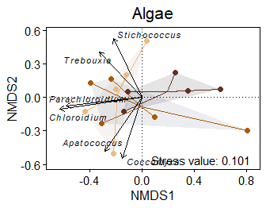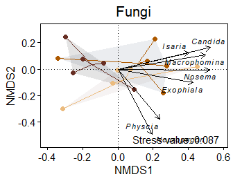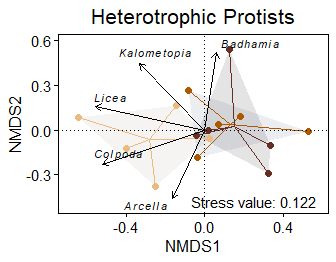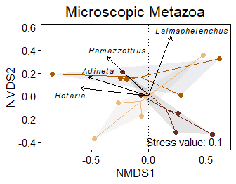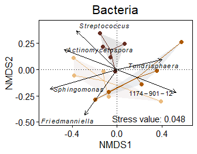

Further, we perform non-metric multidimensional scaling (NMDS) based on
Bray-Curtis dissimilarity and and test for significant differences among
tree species using perMANOVA and pairwiseAdonis.

``` r
# Load RNA count- and meta- and taxonomy data 
load("Data/PreprocessedData/03CanopyBarkDataTraitsFiltered.rds")

# Check if corresponding row and column names match, else save tables as Data
if(!all(identical(colnames(counts), rownames(metadata)), 
        identical(rownames(counts), rownames(taxonomy)))){
  stop("Corresponding row and column names must match")
}

# Normalize counts (relative counts)
counts <- sweep(x = counts, MARGIN = 2, STATS = colSums(counts), FUN = '/')

# Create a data frame for the statistic 
statistic <- setNames(data.frame(matrix(ncol = 5, nrow = 0)),
                      c("MicrobialCommunity", "Factor", "Index", "p", "p.signif"))

# Iterate over the microbial community
for(index.microbial.community in seq(length(indices))){

  # Filter data by microbial community
  counts.sub <- counts[indices[[index.microbial.community]],]
  microbial.community <- paste0(sprintf("%02d", index.microbial.community),
                                names(indices)[index.microbial.community])

  #--------------------------- Test for significant differences -----------------------#
  # Calculate distance matrix
  dist.matrix <- vegdist(data.frame(t(counts.sub)), method = "bray")
  
  # Iterate over models
  p.value <- 1
  for(m in c("TreeSpecies", "Contrasts")){
      
    # Test for significant differences
    if(m == "TreeSpecies"){
      # perMANOVA
      set.seed(12345)
      perm <- setNames(data.frame(adonis2(dist.matrix ~ TreeSpecies, data = metadata, by="terms")),
                       c("Df", "SumOfSqs", "R2", "Fvalue","Pvalue"))
      
      # Subset permanova results to only tested factors
      perm <- perm[!rownames(perm) %in% c("Residual", "Total"),]
      
      # Add column indicating the factors
      perm$Factor <- rownames(perm)
      p.value <- perm$Pvalue
      
    } else if(p.value < 0.05) {
      # Pairwise Adonis
      set.seed(12345)
      perm <- pairwise.adonis2(dist.matrix ~ TreeSpecies, data = metadata)
      
      # Rename data frames
      names(perm) <- 
        gsub("_", " ", sub("Quercus robur", "Oak", 
                           sub("Tilia cordata", "Lime", 
                               sub("Acer pseudoplatanus", "Maple", names(perm)))))
      
      # Merge data frames
      perm <- setNames(data.frame(do.call(rbind, perm[2:4])), 
                       c("Df", "SumOfSqs", "R2", "Fvalue","Pvalue"))

      # Subset permanova results to only tested factors
      perm <- perm[!grepl("Residual|Total", rownames(perm)),]
      
      # Rename rows
      rownames(perm) <- sub(" vs ", " vs. ", sub("\\.TreeSpecies", "", rownames(perm)))
    }

    # Add column indicating significance
    perm$Significance <- 
      ifelse(perm$Pvalue < 0.001, "***", 
             ifelse(perm$Pvalue < 0.01, "**", 
                    ifelse(perm$Pvalue < 0.05, "*","")))
    
    # Add column indicating the alpha index, the factors and the microbial community
    perm$Factor <- rownames(perm)
    perm$MicrobialCommunity <- microbial.community
    perm$Model <- m

    # Merge with statistic table
    statistic <-  merge(statistic, perm, all = T)
  }

  #-------------------------------------- NMDS plot -----------------------------------#
  # Calculate NMDS
  set.seed(12345)
  NMDS <- metaMDS(data.frame(t(counts.sub)), dist="bray", maxit=1000, trymax=100)

  # Create table for visualization
  plot.table <- data.frame(scores(NMDS, choices=1:2, display="sites"))
  
  # Combine NMDS data and metadata to one data frame
  plot.table <- merge(metadata, plot.table, by.x="SampleID", by.y = 0, all.x = F, all.y = T)

  # Calculate center points
  center.points <- aggregate(cbind(NMDS1, NMDS2) ~ TreeSpecies, data = plot.table, FUN = mean)
  
  # Merge plot table and center points
  data <- merge(plot.table, setNames(center.points, c('TreeSpecies','NMDS_1','NMDS_2')), sort = FALSE, all=T)

  # Define title
  title <-gsub("AlgaeA", "A", gsub("WholeC", "Whole C", gsub("[0-9]", "", microbial.community)))
  
  # Plot NMDS
  g = ggplot(data, aes(x = NMDS1, y = NMDS2)) +
    geom_encircle(aes(fill = TreeSpecies), linetype = "blank", 
                  s_shape = 1, expand = 0, alpha = 0.2) +
    scale_fill_manual(values = alpha(c("#c2b2b4", "#53687e", "gray10"), 0.6),
                      labels = c("Maple", "Oak", "Lime")) +
    geom_segment(mapping = aes(xend = NMDS_1, yend = NMDS_2, color=TreeSpecies)) +
    geom_point(aes(color=TreeSpecies), size=2) +
    scale_color_manual(values = c("burlywood2", "tan3", "coral4"),
                       labels = c("Maple", "Oak", "Lime")) +
    labs(title = title) +
    geom_hline(yintercept = 0, colour="black", linetype="dotted") +
    geom_vline(xintercept = 0, colour="black", linetype="dotted") +
    theme_linedraw()+
    theme(plot.title = element_text(size = 16, hjust = 0.5),
          panel.grid.major = element_blank(), 
          panel.grid.minor = element_blank(),
          legend.title = element_text(size = 13),
          legend.text = element_text(size = 12),
          axis.title.x = element_text(size = 12),
          axis.title.y = element_text(size = 12),
          axis.text.x = element_text(size = 11),
          axis.text.y = element_text(size = 11),
          legend.position="none") +
    guides(col = guide_legend(nrow = 6, byrow = TRUE)) +
    annotate("text", x=Inf,y=-Inf,hjust=1.1,vjust=-0.5,
             label=paste("Stress value:", round(NMDS$stress,3))) 
  print(g)
  
  # Save graph as plot with and without labels
  ggsave(paste0("Results/BetaDiversity/NMDS_", microbial.community, "_Appendix.pdf"), 
         plot = g, width = 3.64, height = 2.55)
  g=g + theme(axis.text.y = element_blank())
  ggsave(paste0("Results/BetaDiversity/NMDS_", microbial.community, "_Appendix_NG.pdf"), 
         plot = g, width = 3.64, height = 2.55)
}

# Save tables
write.table(statistic, "Results/BetaDiversity/BetaDiversity_Statistic.csv", 
            row.names = F, sep = ";", dec = ".")
```

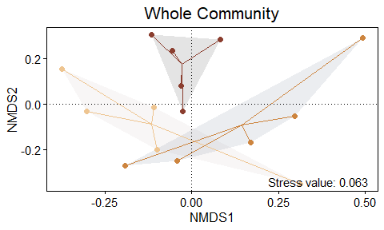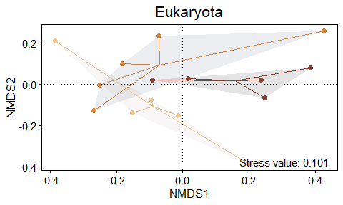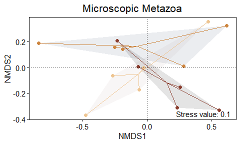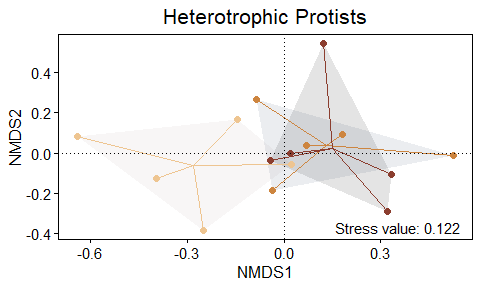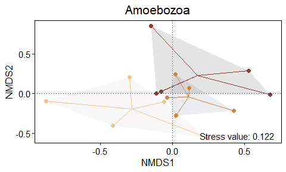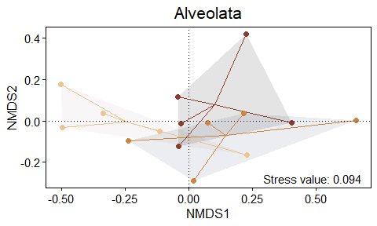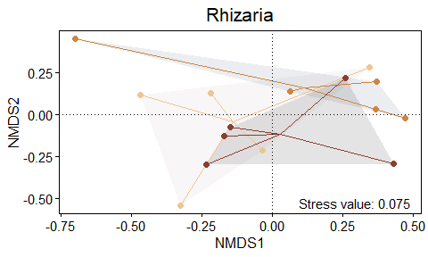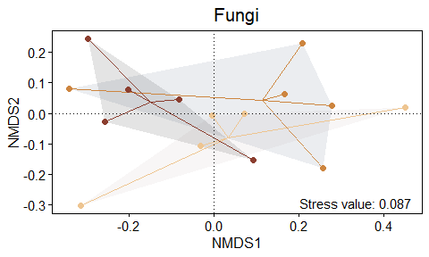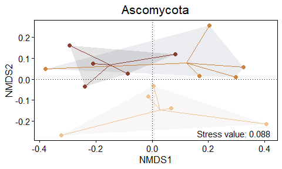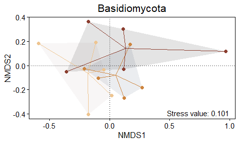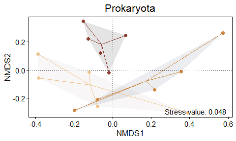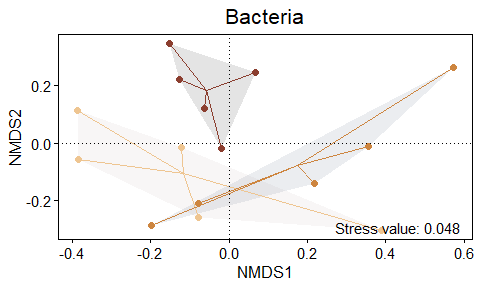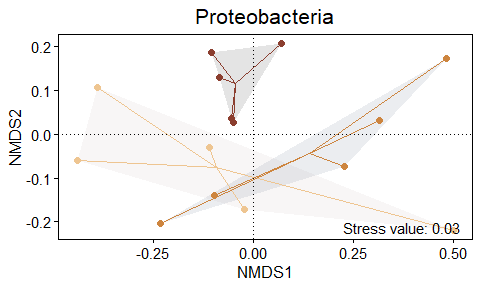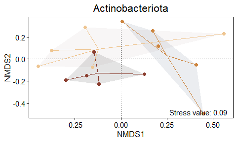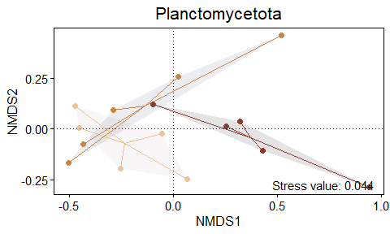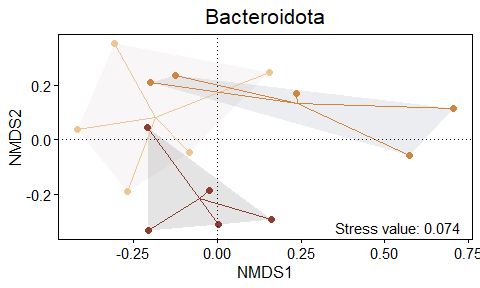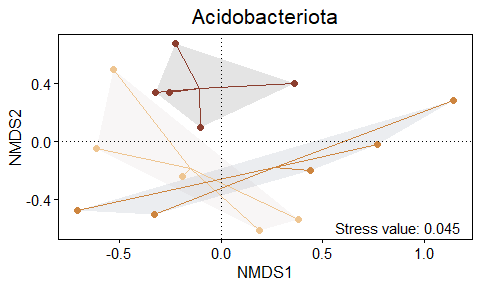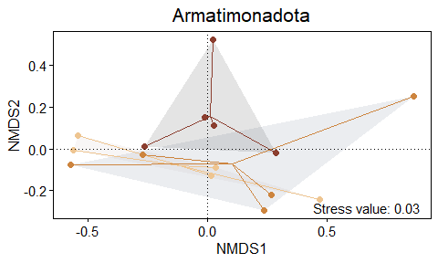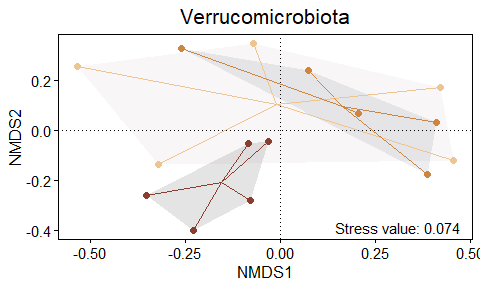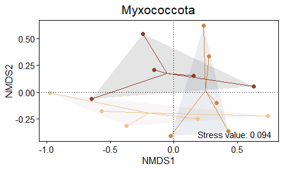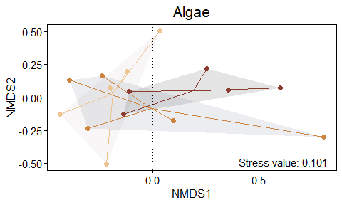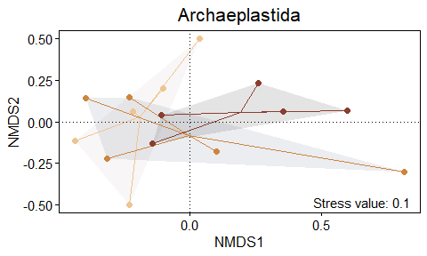
