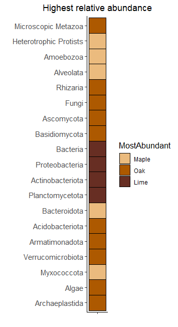
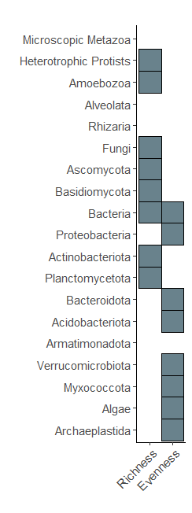
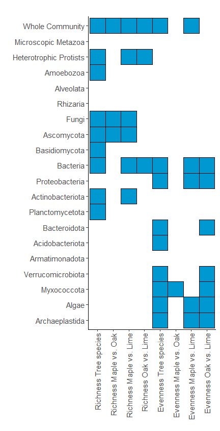
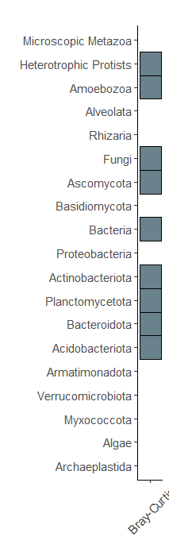
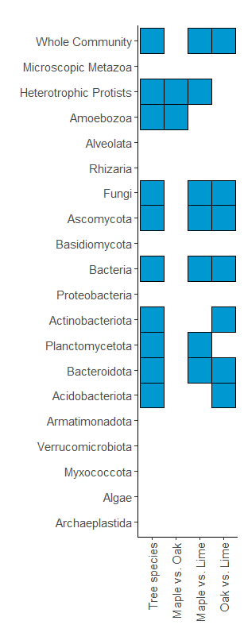

Heatmaps
================
Jule Freudenthal
2024-05-02

**R version:** 4.3.1 (2023-06-16), Beagle Scouts  
**Packages**

- ggplot2 v. 3.5.0

## 01 Relative Abundance

We visualize significant differences in relative abundance across all
tree species with a heatmap, the color code for the highst abundance.

``` r
# Load statistic
statistic <- read.table("Results/BetaDiversity/RelativeAbundance_Statistic.csv", 
                        header = T, sep = ";", dec = ".")

# Order columns Index and Factor and MicrobialCommunity
statistic$MostAbundant <- factor(statistic$MostAbundant, levels = c("Maple", "Oak", "Lime"))
statistic$Rank <- factor(statistic$Rank, 
                         levels = rev(unique(statistic$Rank)))

# Show significance differences between the tree species per Microbial Community
# Visualization
g = ggplot(statistic, aes(x="X", y=Rank, color=MostAbundant, fill=MostAbundant)) + 
  geom_tile(lwd = 0.5, linetype = 1) +
  scale_color_manual(values =c("black", "black", "black")) + 
  scale_fill_manual(values = c("#ebbb7eff", "#ad5900ff", "#672e23ff")) +
  labs(x = "", y="", title = "Highest relative abundance") +
  theme_classic() + 
  theme(plot.title = element_text(hjust=0.5),
        legend.title = element_text(size = 13),
        axis.text.x = element_blank(),
        axis.text.y = element_text(size = 11))
print(g)

# Save graph as plot 
ggsave("Results/Heatmaps/RealtiveAbundance.pdf", 
       plot = g, width = 3.7, height = 6.8)
```

<!-- -->

## 02 Alpha diversity

We visualize significant differences in alpha diversity across all tree
species with a heatmap.

``` r
# Load statistic
statistic <- read.table("Results/AlphaDiversity/AlphaDiversity_Statistic.txt", 
                        header = T, sep = "\t", dec = ".")

# Exclude Whole Community, Eukaryota and Prokaryota
statistic <- statistic[!statistic$MicrobialCommunity %in% 
                         c("01WholeCommunity", "02Eukaryota", "11Prokaryota"),]

# Replace Algae
statistic$MicrobialCommunity <- sub("AlgaeA", "A", statistic$MicrobialCommunity)

# Select only for factor tree species
statistic <- statistic[statistic$Factor %in% "TreeSpecies",]

# Replace all significant p-values (>=  0.05) with 1, others with 0
statistic[statistic$p >=  0.05, "p"] <- 0
statistic[statistic$p !=  0, "p"]  <- 1

# Pvalues as factor
statistic$p <- factor(statistic$p, levels = c("0", "1"))

# Order columns Index and Factor and MicrobialCommunity
statistic$Index <- factor(statistic$Index, levels = 
                             c("Richness", "Evenness")) 
statistic <- statistic[order(statistic$MicrobialCommunity),]
statistic$MicrobialCommunity <- sub("^[0-9].", "", statistic$MicrobialCommunity)
statistic$MicrobialCommunity <- factor(statistic$MicrobialCommunity, 
                                       levels = rev(unique(statistic$MicrobialCommunity)))

# Show significance differences between the tree species per Microbial Community
# Visualization
g = ggplot(statistic, aes(Index, MicrobialCommunity, color=p, fill=p)) + 
  geom_tile(lwd = 0.5, linetype = 1) +
  scale_color_manual(values = alpha(c("white", "black"), c(0, 1)), guide="none") + 
  scale_fill_manual(values = alpha(c("white", "#69828cff"), c(0, 1)), guide="none") +
  labs(x = "", y="", title = "") +
  theme_classic() + 
  theme(plot.title = element_text(hjust=0.5),
        legend.title = element_text(size = 13),
        axis.text.x = element_text(size = 11, angle = 45,hjust=1,vjust=1),
        axis.text.y = element_text(size = 11))
print(g)

# Save graph as plot with and without labels 
ggsave("Results/Heatmaps/AlphaDiversity_TreeSpecies.pdf", 
       plot = g, width = 2.55, height = 6.8)
g <- g+theme(axis.text.x = element_blank())
ggsave("Results/Heatmaps/AlphaDiversity_TreeSpecies_NL.pdf", 
       plot = g, width = 2.55, height = 6.8)
```

<!-- -->

Further, we visualize pairwise significant differences in alpha
diversity between tree species with a heatmap.

``` r
# Load statistic
statistic <- read.table("Results/AlphaDiversity/AlphaDiversity_Statistic.txt", 
                        header = T, sep = "\t", dec = ".")

# Exclude Eukaryota and Prokaryota
statistic <- statistic[!statistic$MicrobialCommunity %in% c("02Eukaryota", "11Prokaryota"),]

# Replace WholeCommunity
statistic$MicrobialCommunity <- sub("WholeCommunity", "Whole Community", statistic$MicrobialCommunity)
statistic$MicrobialCommunity <- sub("AlgaeA", "A", statistic$MicrobialCommunity)
statistic$Factor <- sub("TreeSpecies", "Tree species", statistic$Factor)

# Assign new factor = Index + Factor
statistic$Factor <- paste(statistic$Index, statistic$Factor)

# Replace all significant p-values (>=  0.05) with 1, others with 0
statistic[statistic$p >=  0.05, "p"] <- 0
statistic[statistic$p !=  0, "p"]  <- 1

# Pvalues as factor
statistic$p <- factor(statistic$p, levels = c("0", "1"))

# Order columns Index and Factor and MicrobialCommunity
statistic$Factor <- factor(statistic$Factor, levels = 
                             c("Richness Tree species", "Richness Maple vs. Oak", 
                               "Richness Maple vs. Lime", "Richness Oak vs. Lime", 
                               "Evenness Tree species", "Evenness Maple vs. Oak", 
                               "Evenness Maple vs. Lime", "Evenness Oak vs. Lime")) 
statistic <- statistic[order(statistic$MicrobialCommunity),]
statistic$MicrobialCommunity <- sub("^[0-9].", "", statistic$MicrobialCommunity)
statistic$MicrobialCommunity <- factor(statistic$MicrobialCommunity, 
                                       levels = rev(unique(statistic$MicrobialCommunity)))

# Visualization
g = ggplot(statistic, aes(Factor, MicrobialCommunity, color=p, fill=p)) + 
  geom_tile(lwd = 0.5, linetype = 1) +
  scale_color_manual(values = alpha(c("white", "black"), c(0, 1)), guide="none") +
  scale_fill_manual(values = alpha(c("white", "#0098D0"), c(0, 1)), guide="none") +
  labs(x = "", y="", title = "") +
  theme_classic() + 
  theme(plot.title = element_text(hjust=0.5),
        legend.title = element_text(size = 13),
        legend.text = element_text(size = 12),
        axis.text.x = element_text(size = 11, angle=90,hjust=1,vjust=0.5),
        axis.text.y = element_text(size = 11))
print(g)

# Save graph as plot with and without labels
ggsave("Results/Heatmaps/AlphaDiversity_IndexFactors.pdf",
       plot = g, width = 4.5, height = 8.8)
g <- g+theme(axis.text.x = element_blank())
ggsave("Results/AlphaDiversity/AlphaDiversity_IndexFactors_NL.pdf", 
       plot = g, width = 4.5, height = 6.8)
```

<!-- -->

## 03 Beta diversity

We visualize significant differences in beta diversity across all tree
species with a heatmap.

``` r
# Load statistic
statistic <- read.table("Results/BetaDiversity/BetaDiversity_Statistic.csv", 
                        header = T, sep = ";", dec = ".")

# Exclude Eukaryota and Prokaryota
statistic <- statistic[!statistic$MicrobialCommunity %in% 
                         c("02Eukaryota", "11Prokaryota"),]

# Replace WholeCommunity
statistic$MicrobialCommunity <- 
  sub("WholeCommunity", "Whole Community", statistic$MicrobialCommunity)
statistic$MicrobialCommunity <- sub("AlgaeA", "A", statistic$MicrobialCommunity)
statistic$Factor <- sub("TreeSpecies", "Tree species", statistic$Factor)

# Replace all significant p-values (>=  0.05) with 1, others with 0
statistic[statistic$Pvalue >=  0.05, "Pvalue"]  <- 0
statistic[statistic$Pvalue !=  0, "Pvalue"]  <- 1

# Pvalues as factor
statistic$Pvalue <- factor(statistic$Pvalue, levels = c("0", "1"))

# Order columns Factor and MicrobialCommunity
statistic$Factor <- factor(statistic$Factor, levels = 
                             c("Tree species", "Maple vs. Oak", 
                               "Maple vs. Lime", "Oak vs. Lime")) 
statistic <- statistic[order(statistic$MicrobialCommunity),]
statistic$MicrobialCommunity <- sub("^[0-9].", "", statistic$MicrobialCommunity)
statistic$MicrobialCommunity <- factor(statistic$MicrobialCommunity, 
                                       levels = rev(unique(statistic$MicrobialCommunity)))

# Visualization
g = ggplot(statistic[statistic$Factor=="Tree species"
                     & statistic$MicrobialCommunity != "Whole Community",], 
           aes(Factor, MicrobialCommunity, color=Pvalue, fill=Pvalue)) + 
  geom_tile(lwd = 0.5, linetype = 1) +
  scale_color_manual(values = alpha(c("white", "black"), c(0, 1)), guide="none") +
  scale_fill_manual(values = alpha(c("white", "#69828cff"), c(0, 1)), guide="none") +
  labs(x = "", y="", title = "") +
  scale_x_discrete(breaks="Tree species", labels="Bray-Curtis") +
  theme_classic() + 
  theme(plot.title = element_text(hjust=0.5),
        legend.title = element_text(size = 13),
        legend.text = element_text(size = 12),
        axis.text.x = element_text(size = 11, angle=45,hjust=0.5,vjust=0.5),
        axis.text.y = element_text(size = 11),
        legend.position = "bottom")
print(g)

# Save graph as plot with and without labels
ggsave("Results/Heatmaps/BetaDiversity_TreeSpecies.pdf", plot = g, width = 2.22, height = 7.3)
g <- g+theme(axis.text.x = element_blank())
ggsave("Results/Heatmaps/BetaDiversity_TreeSpecies_NL.pdf", plot = g, width = 2.22, height = 6.8)
```

<!-- -->

Further, we visualize pairwise significant differences in beta diversity
between tree species with a heatmap.

``` r
# Visualization
g = ggplot(statistic, 
           aes(Factor, MicrobialCommunity, color=Pvalue, fill=Pvalue)) + 
  geom_tile(lwd = 0.5, linetype = 1) +
  scale_color_manual(values = alpha(c("white", "black"), c(0, 1)) ,guide="none") +
    scale_fill_manual(values = alpha(c("white", "#0098D0"), c(0, 1)), guide="none") +
  labs(x = "", y="", title = "") +
  theme_classic() + 
    theme(plot.title = element_text(hjust=0.5),
        legend.title = element_text(size = 13),
        legend.text = element_text(size = 12),
        axis.text.x = element_text(size = 11, angle=90,hjust=1,vjust=0.5),
        axis.text.y = element_text(size = 11),
        legend.position = "bottom")
print(g)

# Save graph as plot
ggsave("Results/Heatmaps/BetaDiversity_IndexFactors.pdf",
       plot = g, width = 3.2, height = 8.4)
g <- g+theme(axis.text.x = element_blank())
ggsave("Results/Heatmaps/BetaDiversity_IndexFactors_NL.pdf", 
       plot = g, width = 3.2, height = 6.8)
```

<!-- -->
